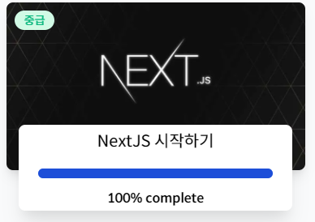
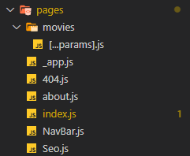

# 강의 소개 😘



해당 강의는 노마드코더 니꼴라스 님의 <a href="https://nomadcoders.co/nextjs-fundamentals/lobby">NextJS 시작하기</a>

를 보고 제작되었음을 미리 밝힙니다.

## 결과물 👓


## 알게 된 점 🤭



NextJS의 특이점에는 Routing 기능이 매우 구조화되어 있다는 것인데,
pages폴더의 구조를 기반으로 경로에 접근했을 때의 콘텐츠가 결정된다.

즉 http://localhost:3000/main 은 pages/main.js의 export default 된 함수의 return을 기반으로 데이터를 얻을 수 있게되는 것

특이점으로는 메인페이지는 index.js 로 아무 경로가 없을경우 호출되며,
잘못된 경로의 경우 404.js, 동적인 경로의 경우 [변수].js 로 받을 수 있으며

중첩된 동적 경로의 경우 [...변수].js 페이지로 관리가 가능하다 


## PreRender 🐱‍🏍

가장 신기하고 멋진 기능이었는데, 페이지를 그려주기 이전 미리 렌더링하는 기능이다. 페이지 상의 코드에서도 js를 불러오는 것이 아닌, html로 코딩한 것과 같은 코드가 들어있기 때문에 SEO 검색 등 다양한 검색엔진에도 유리한것을 알 수 있음

```javascript
// results 는 사전 fetch된 데이터를 담고 있음
export default function Home({results}) {
    return ''
}

export async function getServerSideProps() {
    const {results} = await (await fetch(`http://localhost:3000/api/movies`)).json()
    return {
        props: {
            results
        }
    }
}
```

## config파일 📐

NextJS는 next.config.js파일로 config를 제어하는데, 

```javascript
module.exports = {
    // StrictMode를 활성화 할지 여부
	reactStrictMode: true,
    // source의 경로를 destination경로로 재할당해줌
	async redirects() {
		return [
			{
				source: '/old-blog/:path*',
				destination: '/new-sexy-blog/:path*',
				permanent: false
			}
		];
	},
    // source를 호출했을 때 destination으로 재호출해줌
	async rewrites() {
		return [
			{
				source: '/api/movies',
				destination: `https://api.themoviedb.org/3/movie/popular?api_key=${API_KEY}`
			},
			{
				source: '/api/movies/:id',
				destination: `https://api.themoviedb.org/3/movie/:id?api_key=${API_KEY}`
			}
		];
	}
};

```